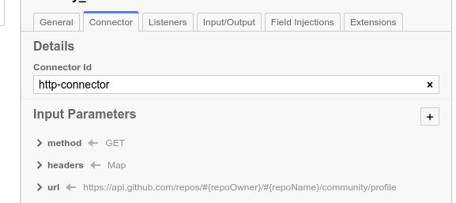
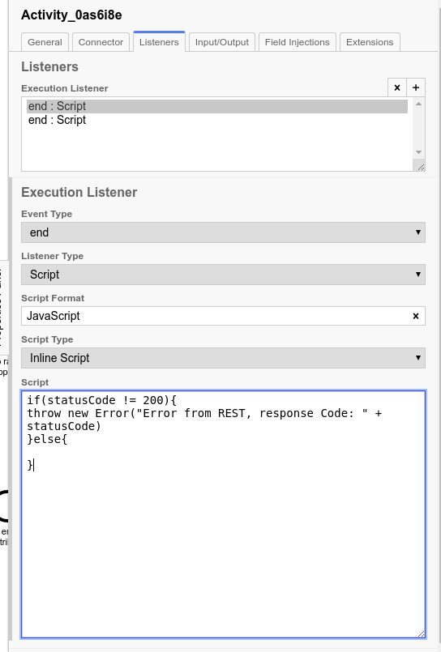

# Make REST calls from Camunda Example

This is an example project shows the 3 most common ways of making REST calls from Camunda Platform to external systems. Each method has it's own pros and cons, it's the aim of this example to guide people to understand which might be the best option for a given requirement.  

 The project covers the implementation of:

* [Java Delegates](https://docs.camunda.org/manual/latest/user-guide/process-engine/delegation-code/)
  * Where the call is made inside a local Java Class which is called by the engine
* [External Task](https://docs.camunda.org/manual/latest/user-guide/process-engine/external-tasks/)
  * Where the calls is made by an external service running independly of the engine
* [Connectors](https://docs.camunda.org/manual/latest/user-guide/process-engine/connectors/)
  * Where the call is made my the engine using properties added directly to the XML of then process model 

Within a process all of the implementations can be used to implement a BPMN [Service Task](https://docs.camunda.org/manual/latest/reference/bpmn20/tasks/service-task/). The best practise guide provides a good [overview of the different options for the implementation of service taks](https://camunda.com/best-practices/invoking-services-from-the-process/).
 Additionally [Task Listeners](https://docs.camunda.org/manual/latest/user-guide/process-engine/delegation-code/#execution-listener) and [Execution Listeners](https://docs.camunda.org/manual/latest/user-guide/process-engine/delegation-code/#execution-listener) can implement Java Delegates.

This project uses 3 Service tasks to outline the different implementations. The following image outlines the process:


:exclamation: Important:
If a REST call returns 2xx status Code this indicates a successful call but it should not be assumed that other codes like 5xx or 4xx would automatically lead to an error within the process. Instead this can be implemented and handled depending on the requirements for each project. For more information read the explanation section.
 

## Run the project
The project contains a Camunda Spring Boot application and a [JavaScript External Task Worker](https://github.com/camunda/camunda-external-task-client-js). Download the project and open the Camunda Spring Boot application in your IDE. Make sure you use Java 11. Start the application.

Start a process instance of the process in Tasklist, by using the predefined start form or start the instance via REST. If you [start the instance via REST](https://docs.camunda.org/manual/latest/reference/rest/process-definition/post-start-process-instance/) make sure the needed variables are included.
Example for the Request body:
```Json
{
  "variables": {
    "repoName" : {
        "value" : "Name of Repo",
        "type": "String"
    },
    "repoOwner" : {
      "value" : "Name of Repo Owner",
      "type": "String"
    }
  },
 "businessKey" : "myBusinessKey"
}

```

Navigate to the folder of the Javascript External Task client. Install the following packages:
```
npm install camunda-external-task-client-js
npm install node-fetch
```


Now you can run the worker
```
node service.js
```


## Explanation of the implementations
This section provides more information on each implementation. It shows how the response code and the information from the response body can be used differently. In this project a response code that is anything except 200 will create an incident. The information of the response body is either used to complete the task or to throw a BPMN error.


No matter how you implement the call there three main options for how a Service Task can behave:
* complete the task successfully (use the information from the REST call to route the further process)
* throw a [BPMN error](https://docs.camunda.org/manual/latest/reference/bpmn20/events/error-events/) (information gained from the REST call lead to an error that should be handled within the logic of the process)
* create an [incident](https://docs.camunda.org/manual/latest/user-guide/process-engine/incidents/) (information from the REST call lead to a fail and create an incident in the workflow engine, which require an administrator to solve)

### Java Delegate
A Java Delegate is called during the execution and needs to implement the JavaDelegate interface. In this setup the Java Class is deployed to the Camunda Engine.

:file_folder: Note:
The explanation divides the code in different pieces to outline the different concepts. The full class can be found within the project (Make-Rest-Calls-From-Camunda-Example/CamundaApllication/src/main/java/com/example/workflow/FindGitHubRepo.java)

The first part of the class gets the process variables "repoOwner" and "repoName". Those are used to perform the REST call within the Java Code:
```java
@Named
public class FindGitHubRepo implements JavaDelegate {

    @Override
    public void execute(DelegateExecution execution) throws Exception {

        String repoOwner = (String) execution.getVariable("repoOwner");
        String repoName = (String) execution.getVariable("repoName");


        Unirest.setTimeouts(0, 0);
        HttpResponse<String> response = Unirest.get("https://api.github.com/repos/" + repoOwner + "/" + repoName)
                .asString();


```
#### **Create an incident**
The code example then checks the status code. If the response code is not a 200 an exception will be thrown. Within the code this exception is not handled. Hence this will lead to an incident within the Camunda Platform Engine

```java
 if (response.getStatus() != 200) {

            // create incidence if Status code is not 200
            throw new Exception("Error from REST call, Response code: " + response.getStatus());
 }

```
:anger: Make sure that you understand [transactions](https://docs.camunda.org/manual/latest/user-guide/process-engine/transactions-in-processes/) within the Camunda workflow engine. Depending where your last transaction in the process is, the state of the process will roll back to the last transaction, which might not be the service task, where the Error occurred. You can set transactions manually by using the async before and after flag in the modeler.


#### **Throw a BPMN error**
If the response code is 200. The example code gets the response body and parse for the entry of "downloads' '. If the value of downloads is false the code throws a BPMN error. This error can be then handled by the logic of the process:

```java
 } else {

            //getStatusText
            String body = response.getBody();
            JSONObject obj = new JSONObject(body);
            //parse for downloads
            Boolean downloads = obj.getBoolean("has_downloads");

            if (!downloads) {

                // Throw BPMN error
                throw new BpmnError("NO_DOWNLOAD_OPTION", "Repo can't be downloaded");

```


#### **Complete the task**

If the two checks before have not triggered the exception or the bpmn error the example code parses the response body for the number of forks. It sets the variable to the process and the task completes.

```java
} else {

                //parse for forks
                String forks = obj.getString("forks");
                int forksAsNumber = Integer.parseInt(forks);
                //Set variables to the process
                execution.setVariable("forks", forksAsNumber);

            }
```

### External Task
An external task is written into a list. From there an external task worker can fetch and lock it using Camunda's REST API. This means that the external task workers are deployed independently. They are language independent. There is a [list with available clients in different languages](https://github.com/camunda/awesome-camunda-external-clients). This project uses the JavaScript external task client.

:file_folder:
Note: The explanation divides the code in different pieces to outline the different concepts. The full code example can be found within the project (Make-Rest-Calls-From-Camunda-Example/SearchContributorService/service.js)


With the usage of the External Task client it is possible to get variables from the process. Those are then used to make a REST call in Javascript code:

```javascript
client.subscribe("searchContributors", async function({ task, taskService }) {

    const repoName = task.variables.get("repoName");
    const repoOwner = task.variables.get("repoOwner");
 
const url = "https://api.github.com/repos/"+ repoOwner +"/" + repoName + "/contributors"
console.log(url)

try{
const contributors = await fetch(url)
```

#### **Create an incident**
Again we check in the JavaScript Code for the response code. If the code does not equal 200 we throw an error. Later in our JavaScript code we handle the error and use the External Task client to send back a failure to the workflow engine. This failure will then create an incident.
If the response code equals 200 the response body is returned

```javascript
.then(function(response) {    
    if (!response.ok) {
       // throw Exception;
       var e = new Error("HTTP status " + response.status); // e.name is 'Error'
       e.name = 'RestError';
       throw e;
    }
    return response.json();
})

...

// Handle Exception and create an incidence in Workflow Engine
}catch (e){
    await taskService.handleFailure(task, {
        errorMessage: e.name,
        errorDetails: e.message,
        retries: 0,
        retryTimeout: 1000
      });

}

```


#### **Throw a BPMN error**
Then the information of the response body is used. The example uses the information of the number of contributors. If the number is smaller or equals one the external task worker sends back a BPMN Error:

```javascript
var numberContributors = Object.keys(contributors).length;

if(numberContributors <= 1){
    const processVariables = new Variables();
    processVariables.set("errorMessage", "Sorry the repo has just one or none contributor, look for another one");
    await taskService.handleBpmnError(task, "NO_CONTRIBUTORS", "The repo has no contributors", processVariables);
}

```

#### **Complete the task**
If there is more than one contributor. The External Task worker uses the client method to complete the task and send back variables to the process:

```javascript
//Complete Task
const processVariables = new Variables();
processVariables.set("contributors", numberContributors);
await taskService.complete(task, processVariables)
```


### Connectors
The two previous examples implemented the REST call within their code. The benefit is that everything is together in one place and one can easily handle the different outcomes.

Connectors within Camunda provide an API for simple HTTP and SOAP connections. There is no need to implement the REST call with code. However handling the different outcomes is more complicated and requires the usage of Script.

:anger: Note:
Be aware of the other two options. Depending how complicated the REST call and the proceeding of the response get, the other options above might be more suitable.

In order to use connectors and the http client the connect dependency and the http client have to be added to the POM file:
```xml
    <dependency>
      <groupId>org.camunda.bpm</groupId>
      <artifactId>camunda-engine-plugin-connect</artifactId>
    </dependency>

    <dependency>
      <groupId>org.camunda.connect</groupId>
      <artifactId>camunda-connect-http-client</artifactId>
    </dependency>
```
In order to parse the response body it can be helpful to include the [Spin Plugin](https://docs.camunda.org/manual/latest/reference/spin/) as well. To add Spin and Json the dependencies are added to the pom file.

```xml
  <dependency>
      <groupId>org.camunda.bpm</groupId>
      <artifactId>camunda-engine-plugin-spin</artifactId>
    </dependency>

    <dependency>
      <groupId>org.camunda.spin</groupId>
      <artifactId>camunda-spin-dataformat-json-jackson</artifactId>
    </dependency>
```
This [project](https://github.com/rob2universe/camunda-http-connector-example) shows a simple use case for connectors too.

To configure the Connector the Input Parameters must be set. To configure a GET call, the method, the url and the headers must be set:



The configuration of the Connector allows setting output variables.


The response Code can be accessed easily with the Expression:
```
${statusCode}
```
In order to parse the body we use an Expression in combination with Spin
```
${S(response).prop("health_percentage")}
```


#### **Create an incident**
Just as the exmaples above, the connector should should be create an incident if the response code is not 200.

:anger: Make sure that you understand [transactions](https://docs.camunda.org/manual/latest/user-guide/process-engine/transactions-in-processes/) within the Camunda workflow engine. Depending where your last transaction in the process is, the state of the process will roll back to the last transaction, which might not be the service task, where the Error occurred. You can set transactions manually by using the async before and after flag in the modeler.


In order to observe the incident at the right place in this project the async before flag is set. It will also ensure that the transaction isn't rolled back too far. 

The response Code is defined as an output variable. In order to check the value of the variable the project uses some [Script](https://docs.camunda.org/manual/latest/user-guide/process-engine/scripting/). Script can be uses at various places. For example it can be used directly by defining the output variable of a Connector. This example uses Script as an [Execution Listener](https://docs.camunda.org/manual/latest/user-guide/process-engine/scripting/#use-scripts-as-execution-listeners) at the end of the Connector.




If the response code does not equal 200 the Script throws an error. As the error is not handled this leads to an incident within the workflow engine.

:bangbang:
In this project the incident will be created before. If the response is not 200 the response body looks different. Hence the Expression that we use to store the health percentage ```${S(response).prop("health_percentage")}``` fails. The accompined incident message won't give details about the failed REST call. Rather it contains the information that the evaluation of the expression has failed. This outlines one of the challenges working with Connectors. If the evaluation of the response code and the different variables is handled within the same code, it is easier to maintain the outcome and the logic.


#### **Throw a BPMN error**
The example uses the gained information about the health percentage. An Execution Listener at the end of the connector is used to evaluate the value of the variable.
```javascript
health = execution.getVariable("healthPercentage");

if(health < 70){

execution.setVariable("healthPercentage", health);
throw new org.camunda.bpm.engine.delegate.BpmnError("error-not-healthy");

}else{
execution.setVariable("healthPercentage",health);
}
```
#### **Complete the task**

With a Connector the task completes after calling the REST endpoint.


